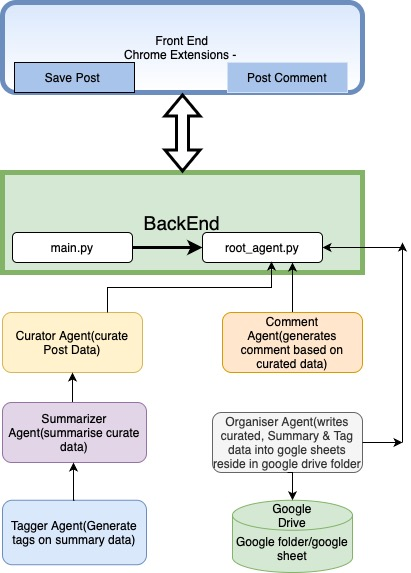

# 🧠 LinkedIn AI Curator – Chrome Extension + Google ADK Project

**LinkedInAI_Assistant** is an intelligent AI-powered Chrome extension built for the **Google ADK Hackathon**. It empowers professionals to **save** and **comment** on LinkedIn posts with the help of Google’s Agent Development Kit (ADK) and Gemini models.

🧩 Agents extract and summarize post content, generate hashtags, provide tailored comment suggestions, and save structured output into Google Sheets — enabling effortless LinkedIn content curation.

---

## 🚀 Key Features

### 🖱 Chrome Extension (Frontend)
- **Save Post**: Extracts LinkedIn content, author, and engagement metrics
- **Post Comment**: Suggests 3 professional AI-generated comments
- Interactive UIs:
  - `popup-comment.html`: Displays comment suggestions

### 🤖 Backend AI Agent Flow (via Google ADK)
1. **Curator Agent** – Parses post content and metadata
2. **Summarizer Agent** – Generates concise summaries using Gemini
3. **Tagger Agent** – Suggests 5 relevant hashtags
4. **Commentor Agent** – Recommends 3 short, insightful comments
5. **Organizer Agent** – Logs all results into Google Sheets

---

## 🧱 Architecture Overview



---

## 🧱 Project Structure

```plaintext
LinkedInAI_Assistant/
│
├── backend/
│   ├── agents/
│   │   ├── curator_agent.py
│   │   ├── summarizer_agent.py
│   │   ├── tagger_agent.py
│   │   ├── comment_agent.py
│   │   └── organizer_agent.py
│   │
│   ├── keys/
│   │   └── credentials.json
│   │
│   ├── gemini_config.py
│   ├── main.py
│   └── root_agent.py
│
├── frontend/
│   ├── content.js
│   ├── background.js
│   ├── popup.js
│   ├── popup-comment.js
│   ├── popup.html
│   ├── popup-comment.html
│   ├── manifest.json
│   └── icons/
│       └── icon16.png
│
├── requirements.txt
└── README.md
```

---

## ⚙️ Setup Instructions

### 1. Clone the Repository
```bash
git clone https://github.com/AJ141181/LinkedIn-AI-Assistant.git
cd LinkedIn-AI-Assistant
```

### 2. Install Python Dependencies
```bash
pip install -r requirements.txt
```

### 3. Set Up Google Credentials
- Ensure `credentials.json` is inside `backend/keys/`
- Enable **Google Sheets API** and **Drive API** in your Google Cloud Project
- Share your destination spreadsheet with the service account email found in `credentials.json`

### 4. Run the Backend Pipeline Locally
```bash
python backend/main.py
```

---

### 🔑 Gemini API Key Setup

Ensure your Gemini API key is configured in `backend/gemini_config.py`:

```python
import google.generativeai as genai

genai.configure(api_key="YOUR_API_KEY")
model = genai.GenerativeModel("gemini-pro")
```

> ⚠️ Do not share your API key publicly or commit it to GitHub.

---

## 🧩 Chrome Extension Setup

1. Open Chrome and go to [`chrome://extensions`](chrome://extensions)
2. Enable **Developer Mode**
3. Click **Load unpacked** and select the `frontend/` folder
4. Navigate to LinkedIn and:
   - Click **🔖 Save Post** to trigger the curation pipeline
   - Click **💬 Post Comment** to open the extension with suggested replies

---

## 🌐 Live Backend URL (for Testing)

```
https://linkedin-curator-198258385336.us-central1.run.app
```

---

## 🚀 Cloud Deployment via Docker (Optional)

To deploy the backend to **Google Cloud Run**:

```bash
gcloud builds submit --tag gcr.io/YOUR_PROJECT_ID/linkedin-curator

gcloud run deploy linkedin-curator \
  --image gcr.io/YOUR_PROJECT_ID/linkedin-curator \
  --platform managed \
  --region us-central1 \
  --allow-unauthenticated
```

> Replace `YOUR_PROJECT_ID` with your actual GCP project ID.

---

## 🔐 Required API Scopes

Your service account must have access to:

- `https://www.googleapis.com/auth/drive`
- `https://www.googleapis.com/auth/spreadsheets`

---

## 🛠 Tech Stack

- 🧠 **Google ADK** – Agent orchestration and LLM tools
- ✨ **Gemini Pro** – Summary, tags, and comment generation
- 🧩 **Python** – Backend processing logic
- 🧠 **Pydantic** – Agent schema validation
- 📊 **Google Sheets API** – Data logging
- 🧩 **Chrome Extension (Manifest v3)** – Frontend integration

---

## 🎯 Hackathon Use Case

Helps professionals instantly extract, analyze, and interact with LinkedIn content. Saves time, boosts engagement quality, and supports weekly content reporting — all powered by Google's AI infrastructure.

---

## 🔮 Planned Features

- Weekly trend digest using tag frequency
- Email summaries via Gmail API
- Notion / Firebase integration
- Analytics dashboard for AI-generated tags and engagement

---

## 📄 License

MIT License – use freely, improve collaboratively.
